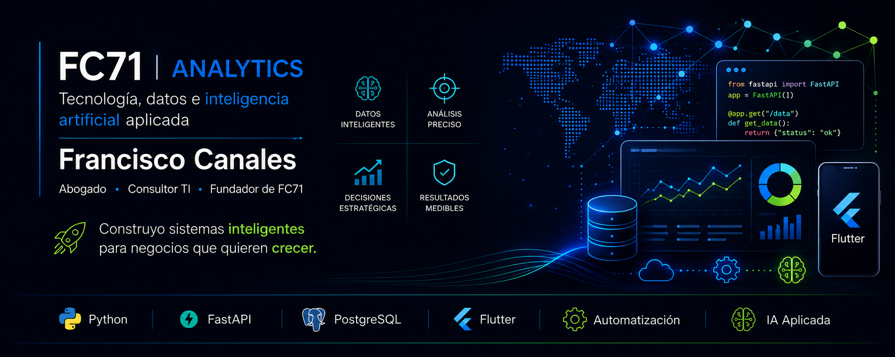

  

## Sobre mí

Soy abogado y consultor TI, fundador de FC71 Analytics. Desarrollo soluciones
con Python, FastAPI, Flutter, PostgreSQL e inteligencia artificial aplicada.

## Áreas de trabajo

- Automatización de procesos
- Inteligencia artificial aplicada
- Analítica de datos
- Desarrollo de aplicaciones
- Consultoría tecnológica y legal

## Tecnologías

Python · FastAPI · PostgreSQL · Flutter · GitHub · IA

## Proyectos principales

- FC71 Analytics
- IDTAP365
- AvaluoInm24
- FC71 Shop
- Centro de Inteligencia Operativa FC71

## Contacto

🌐 https://fc71analytics.site/
